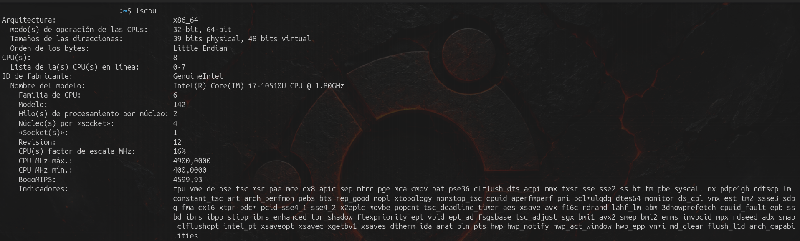

# CPU Basics

## ¿Qué es la CPU?

La CPU es el componente encargado de interpretar y ejecutar instrucciones.

Cuando usamos programas como Firefox, VS Code o la terminal, la CPU realiza parte del trabajo necesario para que esos programas funcionen.

## Procesador físico

Mi equipo tiene un procesador:

Intel Core i7-10510U

Dentro de ese procesador existen varios núcleos físicos.

## Núcleos físicos

Mi CPU tiene 4 núcleos físicos.

Cada núcleo puede ejecutar instrucciones.

Tener varios núcleos permite realizar más trabajo en paralelo.

Idea clave:

Más núcleos = mayor capacidad para ejecutar tareas al mismo tiempo.

## Hilos lógicos

Cada núcleo de mi CPU puede manejar 2 hilos lógicos.

Por lo tanto:

4 núcleos × 2 hilos = 8 hilos lógicos

Linux puede utilizar estos 8 hilos como CPUs lógicas.

Importante:

8 hilos lógicos no significa que existan 8 núcleos físicos.

## Comandos utilizados

### lsproc

