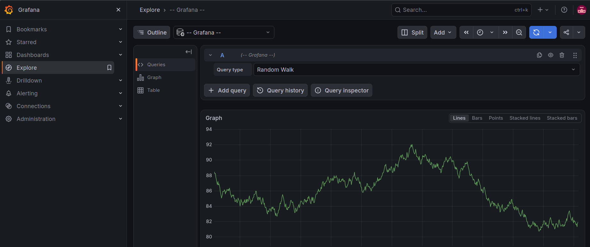

# Grafana con Docker Compose

## Objetivo

Levantar Grafana en un contenedor usando Docker Compose como parte del laboratorio de observabilidad.

## Configuración

Grafana se ejecuta mediante el archivo `compose.yaml`.

Puerto utilizado:

- Host: 3000
- Contenedor: 3000

Acceso local:

http://localhost:3000

## Comandos utilizados

Levantar Grafana:

```bash
docker compose up -d grafana

## Evidencia

Grafana ejecutándose correctamente en Docker:


