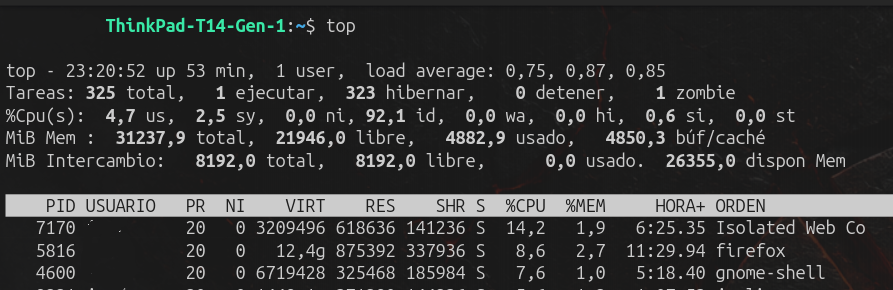

# top

## ¿Qué es?

`top` es una herramienta de Linux que muestra en tiempo real el estado general del sistema y los procesos.

Permite observar, entre otras cosas:

- CPU
- memoria RAM
- swap
- cantidad de tareas/procesos
- load average
- procesos que más recursos consumen

## CPU en top

La línea `%Cpu(s)` muestra distintos tipos de uso de CPU.

**us = user**  
CPU utilizada por programas y procesos del usuario.

**sy = system**  
CPU utilizada por el kernel de Linux y tareas del sistema operativo.

**id = idle**  
Porcentaje de tiempo en que la CPU está inactiva.

**wa = I/O wait**  
Porcentaje de tiempo en que la CPU está esperando operaciones de entrada/salida.

### Idea clave

`us` → programas del usuario  
`sy` → sistema operativo  
`id` → CPU inactiva  
`wa` → CPU esperando I/O

### Evidencia

